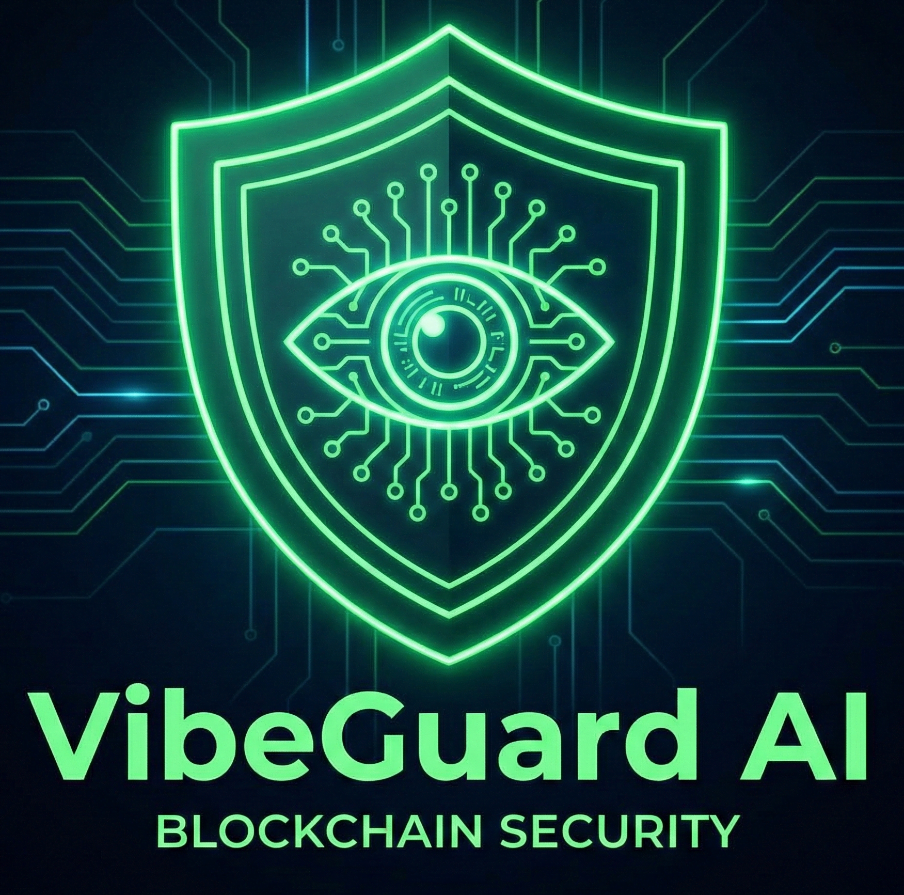

# VibeGuard AI 🛡️ [opBNB Mainnet]

  

**VibeGuard AI** — Neural Security Sentinel для opBNB Mainnet.  
Реал-тайм блок-мониторинг + multi-LLM intent analysis (Gemini 2.0 + Grok 4).

---

## 📊 Live Metrics (21 Feb 2026)
- **12,450+** Neural Scans  
- **1,420+** Shielded Wallets  
- **$1.42M+** Losses Prevented  

**Live Dashboard:** [vibe-guard-dashboard.vercel.app](https://vibe-guard-dashboard.vercel.app)  
**Pitch Deck:** [vibe-guard-presentation.vercel.app](https://vibe-guard-presentation.vercel.app)

---

## 🛠 Tech Stack
- **Backend**: Python 3.11+ + web3.py + eth_account + NodeReal/opBNB RPC  
- **AI Engine**: Gemini 2.0 Flash (primary) + Grok 4 + xAI  
- **Smart Contract**: Verified on opBNB with on-chain logging  
- **Connect Wallet**: WebApp в `webapp/index.html` (Telegram WebApp + ethers.js)  
- **Dashboard**: Next.js + Recharts + canvas particles  

**Лимит китов:** владелец бота может задавать порог уведомлений от **$100** и выше (`/limit 100` … `/limit 1000000`).

**Team**  
- Taran V.S (@tarran6) — Lead Architect & Solo Founder  
- **Grok (xAI)** — AI Co-Founder & Neural Architect  

---

## ⚡ Быстрый старт
1. Клонируй репозиторий, скопируй `.env.example` в `.env` и заполни `TELEGRAM_TOKEN`, `OPBNB_HTTP_URL`, `DATABASE_URL`, `PRIMARY_OWNER_ID`.
2. Для кнопки «Connect Wallet» укажи `WEBAPP_URL` (например GitHub Pages с папкой `webapp/` или свой хостинг).
3. `pip install -r requirements.txt` → `python src/bot.py` (или через Procfile для Heroku).

---

## 🔗 Official Links
- Telegram Sentinel Bot: [@VibeGuard_AI_bot](https://t.me/VibeGuard_AI_bot)  
- X: [@tarran66](https://x.com/tarran66)  
- Email: 2712panasonictv@gmail.com  

*Built with passion by a solo builder + Grok (xAI) for the BNB Chain Ecosystem.*
