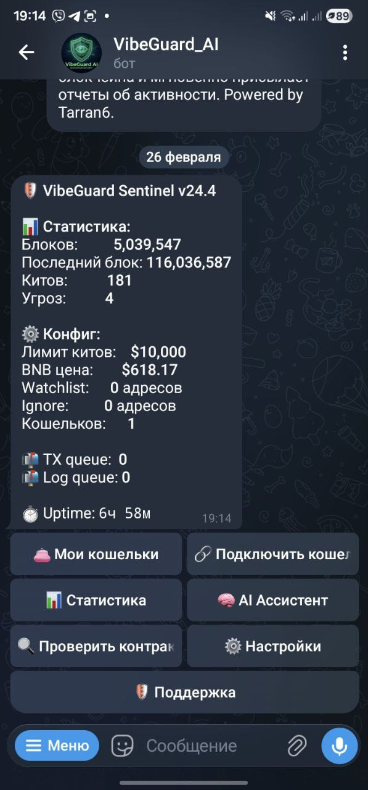
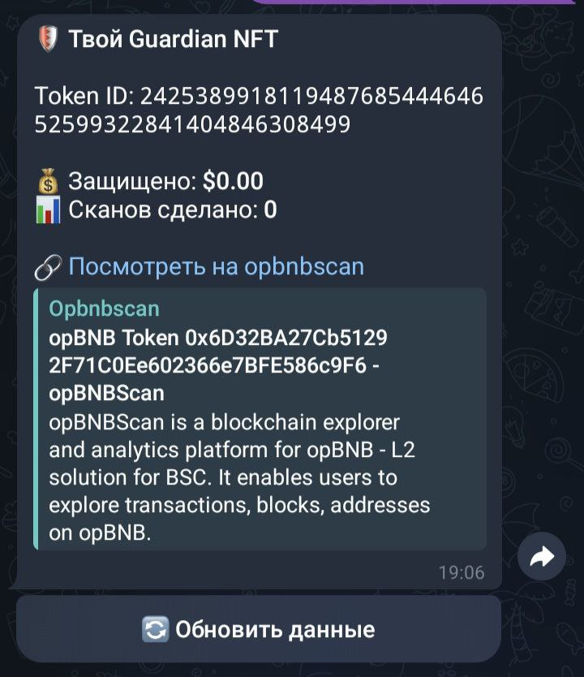
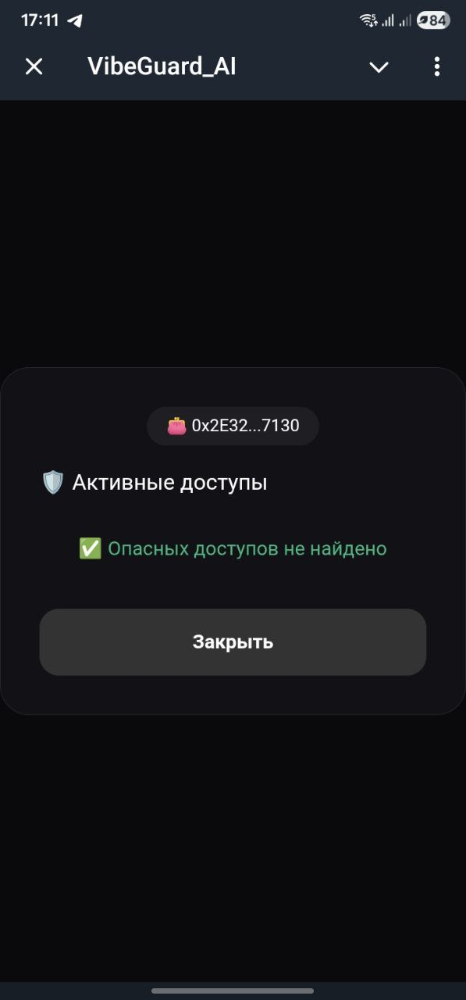
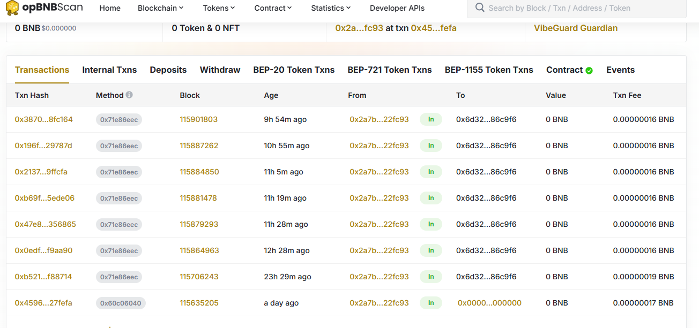

# 🛡️ VibeGuard AI — Neural Security Sentinel + NFA Guardian

**The world's first Neural Non-Fungible Agent (BAP-578) for real‑time user protection on opBNB**

---

## 📊 Live Metrics (as of February 26, 2026)

- **Blocks processed:** 5,039,547
- **Whales detected:** 181
- **Threats identified:** 4
- **Connected wallets:** 1 (first user)
- **Minted Guardian NFTs:** 1 (first on opBNB)
- **Total contract transactions:** 158
- **Value protected:** in progress

**[Live Dashboard](https://vibe-guard-dashboard.vercel.app)** | **[Pitch Deck](https://vibe-guard-presentation.vercel.app)** | **[Telegram Bot](https://t.me/VibeGuard_AI_bot)** | **[opBNB Contract](https://opbnbscan.com/address/0x6D32BA27Cb51292F71C0Ee602366e7BFE586c9F6)**

---

## 🎯 What is VibeGuard AI?

**VibeGuard AI** is a Neural Security Sentinel that scans every block of opBNB in real time, analyzes transactions using a multi‑layer AI (Gemini 2.0 Flash + Grok 4 + DeepSeek), and instantly alerts users to threats.

Each connected wallet receives a **personal Guardian NFT** (BAP‑578 Non‑Fungible Agent) that records protection history and can evolve over time.

---

## 🖼️ Screenshots

| Main bot menu | Whale alert with AI analysis |
|:---:|:---:|
|  |  |

| Personal Guardian NFT | WebApp after wallet connection |
|:---:|:---:|
|  |  |

| On‑chain activity of the contract |
|:---:|
|  |

---

## 🛠 Tech Stack

- **Blockchain:** opBNB Mainnet + BAP-578 NFA
- **AI:** Gemini 2.0 Flash (primary) + Grok 4 + DeepSeek (fallback)
- **Backend:** Python + Asyncio + Web3.py + PostgreSQL
- **Frontend:** Telegram WebApp + ethers.js + Reown AppKit
- **Deployment:** Docker + Railway

---

## 🚀 How It Works

1. User connects a wallet via the WebApp.
2. A **Guardian NFT** (BAP‑578) is automatically minted.
3. VibeGuard starts scanning all transactions in real time.
4. When a threat is detected, an instant alert is sent to Telegram.

---

## 📈 Roadmap

- **Q1 2026** — NFA + MCP integration (done)
- **Q2 2026** — Release of Chrome extension
- **Q3 2026** — Mobile app (iOS/Android)
- **Q4 2026** — $VIBE token and DAO

---

## 💰 Monetization

- **Freemium:** basic protection free, premium features via subscription.
- **B2B API:** integrate our AI engine into third‑party wallets and exchanges.
- **Contract auditing:** paid verification for new projects.
- **NFT upgrades:** visual improvements for Guardians.

---

## 🤝 Contacts

- Telegram: [@tarran6](https://t.me/tarran6)
- X: [@Tarran6](https://x.com/Tarran6)
- GitHub: [Tarran6/VibeGuard-AI](https://github.com/Tarran6/VibeGuard-AI)

---

**VibeGuard AI — because security should be smart.**

*Built with ❤️ on opBNB + Grok 4 + BAP-578*
